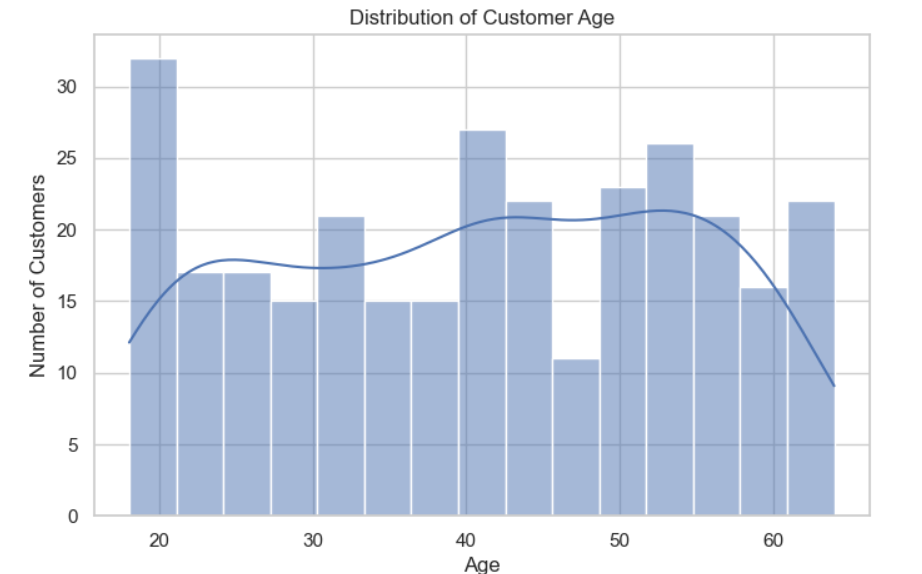
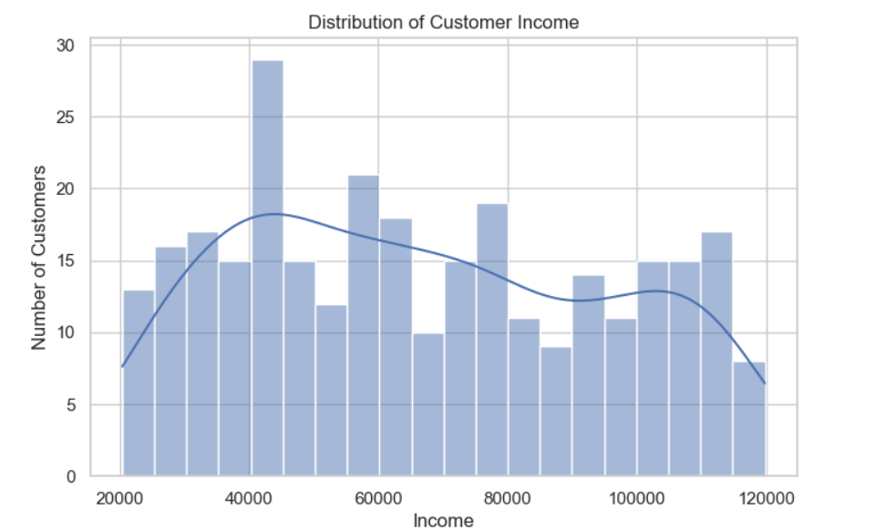
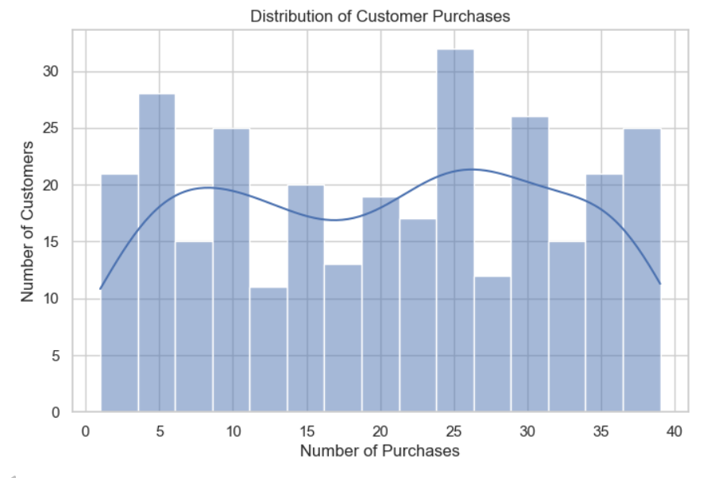
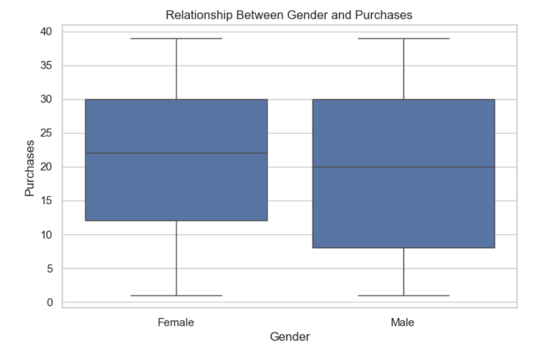
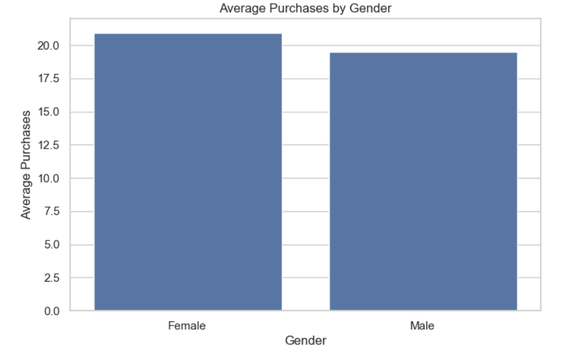
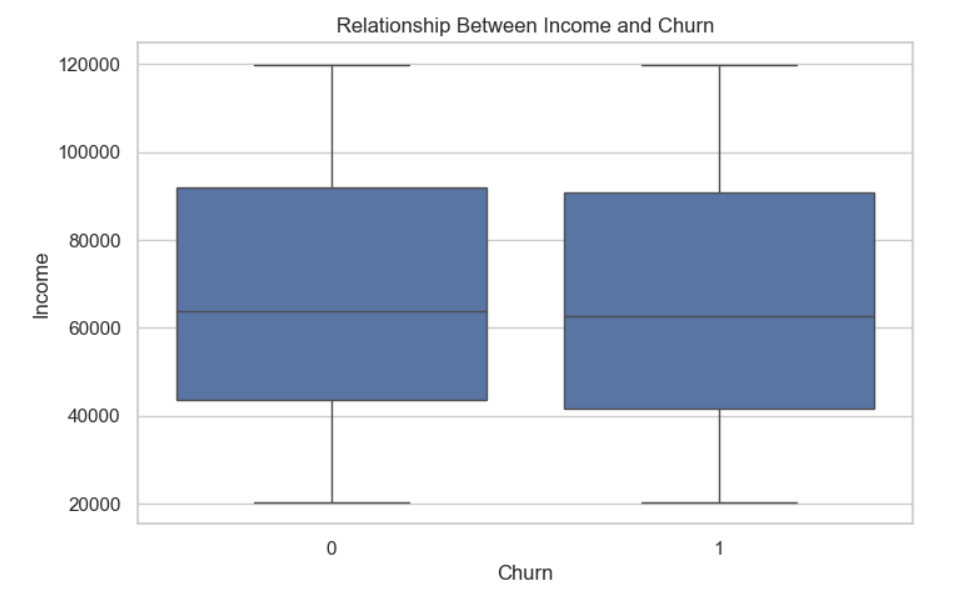
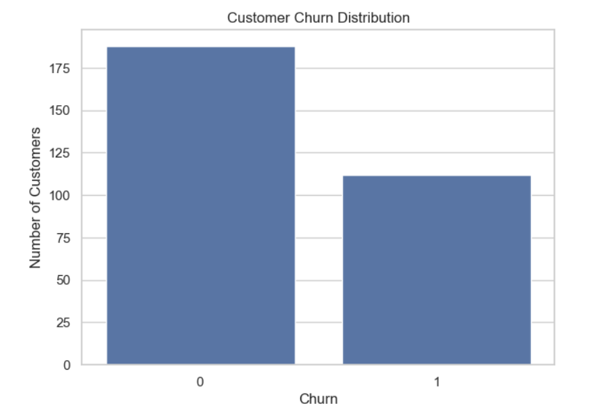
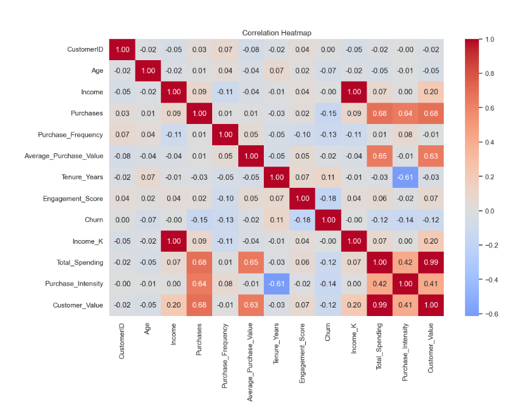
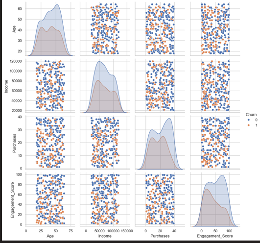

# 📊 Data Profiler

### Data Preprocessing & Feature Engineering

> A practical customer-data project covering **data acquisition, data cleaning, exploratory data analysis (EDA), feature engineering, data profiling, and ML-ready dataset preparation**.

---

## 🎯 Objective

The objective of this project is to understand, clean, transform, profile, and analyze customer data before it is used for machine learning.

The project also frames a **customer churn prediction** problem based on customer purchase behavior.

---

## 🖥️ Dashboard / EDA Screenshot

## 📸 Project Screenshots

### 1. Distribution of Customer Age


### 2. Distribution of Customer Income


### 3. Distribution of Customer Purchases


### 4. Relationship Between Gender and Purchases


### 5. Average Purchases by Gender


### 6. Relationship Between Income and Churn


### 7. Customer Churn Distribution


### 8.Correlation Heatmap


### 9.pairplot

---

## 🧠 Machine Learning Problem

### Problem Statement

**Predict whether a customer will churn based on purchase behavior and customer characteristics.**

### Target Variable

`Churn`

- `0` → Customer does not churn
- `1` → Customer churns

### Problem Type

**Supervised Learning — Binary Classification**

Potential predictive features include:

- Age
- Income
- Purchases
- Purchase Frequency
- Average Purchase Value
- Tenure
- Engagement Score
- Engineered customer-value features

---

## 📂 Dataset

The main dataset is `customer_data_profiler.csv`.

| Column | Description |
|---|---|
| `CustomerID` | Unique customer identifier |
| `Age` | Customer age |
| `Gender` | Customer gender |
| `Income` | Customer income |
| `Purchases` | Number of purchases |
| `Purchase_Frequency` | Purchase frequency |
| `Average_Purchase_Value` | Average value per purchase |
| `Tenure_Years` | Customer relationship duration |
| `Engagement_Score` | Customer engagement score |
| `Churn` | Churn target: 0 or 1 |

The source CSV intentionally includes **missing values, inconsistent gender labels, and a duplicate record** so the data-cleaning workflow can be demonstrated.

---

## 🔄 Project Workflow

```text
Data Acquisition
      ↓
Data Understanding
      ↓
Data Cleaning
      ↓
Exploratory Data Analysis
      ↓
Feature Engineering
      ↓
Data Profiling
      ↓
ML-Ready Dataset
```

---

## 📥 Data Acquisition

The project demonstrates working with multiple data formats and sources:

- CSV using Pandas
- JSON using Pandas
- SQL using SQLite
- REST API using Python Requests

The CSV remains the primary customer dataset, while JSON and SQL are used to demonstrate multi-source data handling.

---

## 🧹 Data Cleaning

The following preprocessing tasks are performed:

- Missing-value detection
- Missing-value imputation
- Duplicate detection and removal
- Data-type correction
- Categorical-value standardization
- Data-quality checks

Example:

```text
Male, male, M     → Male
Female, female, F → Female
```

---

## 📈 Exploratory Data Analysis

### Univariate Analysis

The distributions of:

- Age
- Income
- Purchases

are analyzed using histograms.

### Bivariate Analysis

The project examines:

- Gender vs Purchases
- Income vs Churn

using box plots and bar charts.

### Multivariate Analysis

The project uses:

- Correlation heatmap
- Pair plot

These visualizations help identify relationships among numerical variables.

---

## ⚙️ Feature Engineering

Additional features are created from existing customer information, including:

| Feature | Purpose |
|---|---|
| `Income_K` | Income expressed in thousands |
| `Total_Spending` | Purchases × Average Purchase Value |
| `Purchase_Intensity` | Purchases relative to tenure |
| `Customer_Value` | Combined customer-value indicator |
| `Age_Group` | Categorized age groups |

---

## 🔬 Data Profiling

The profiling stage summarizes:

- Data types
- Missing values
- Missing percentages
- Unique values
- Descriptive statistics
- Correlations
- Potential data-quality issues

This helps verify whether the dataset is suitable for further analysis and machine learning.

---

## 🧮 Tensor Concepts

The project also explains the fundamentals of **tensors** using NumPy.

- **0-D:** Scalar
- **1-D:** Vector
- **2-D:** Matrix
- **3-D:** Multidimensional array
- **Higher-D:** Higher-dimensional numerical structure

Tensor concepts are important for understanding how numerical data is represented in modern machine-learning and deep-learning systems.

---

## 🛠️ Technologies Used

- 🐍 Python
- 🐼 Pandas
- 🔢 NumPy
- 📊 Matplotlib
- 🎨 Seaborn
- 🗄️ SQLite
- 🌐 Requests
- 📓 Jupyter Notebook

---

## 📁 Repository Structure

```text
Data-Profiler/
│
├── Data_Profiler.ipynb
├── customer_data_profiler.csv
├── customer_purchases.json
├── customer_database.db
├── customer_ml_ready.csv
├── screenshots
│  ├── ss_1.png
│  ├── ss_2.png
│  ├── ss_3.png
│  ├── ss_4.png
│  ├── ss_5.png
│  ├── ss_6.png
│  ├── ss_7.png
│  ├── ss_8.png
│  └── ss_9.png│
└── README.md

```

> Place the generated `dashboard.png` inside an `assets` folder when uploading to GitHub, then keep the README image path as `assets/dashboard.png`.

---

## ▶️ How to Run

### 1. Clone the repository

```bash
git clone <your-repository-url>
cd Data-Profiler
```

### 2. Install dependencies

```bash
pip install pandas numpy matplotlib seaborn requests jupyter
```

### 3. Start Jupyter Notebook

```bash
jupyter notebook
```

### 4. Open the notebook

```text
Data_Profiler.ipynb
```

### 5. Run all cells

Keep `customer_data_profiler.csv` in the same directory as the notebook.

---

## 💡 Key Insights

- Customer ages cover a broad adult range, giving the dataset useful demographic variation.
- Income values are spread across a wide range rather than being concentrated around a single value.
- Purchase counts vary considerably between customers, indicating different levels of purchasing activity.
- Female customers have a slightly higher average purchase count than male customers in this dataset.
- Income distributions for churned and non-churned customers overlap substantially, suggesting that income alone is unlikely to be a strong churn predictor.
- Combining purchase behavior, engagement, tenure, and other customer attributes should provide a better basis for churn prediction.

> These are descriptive observations from the dataset and should not be interpreted as causal relationships.

---

## 📌 Expected Outcome

The project transforms raw customer data into a cleaner, more consistent, better-understood dataset that can be used for future machine-learning modeling.

**Raw Data → Clean Data → EDA → Feature Engineering → Profiling → ML-Ready Data**

---

## ⭐ Project Highlights

- ✅ Data preprocessing
- ✅ Data cleaning
- ✅ CSV / JSON / SQL / API acquisition
- ✅ Univariate EDA
- ✅ Bivariate EDA
- ✅ Multivariate EDA
- ✅ Feature engineering
- ✅ Data profiling
- ✅ Tensor fundamentals
- ✅ Customer churn problem formulation
- ✅ ML-ready dataset preparation

---

## 🏁 Conclusion

This project demonstrates an end-to-end **Data Preprocessing and Feature Engineering** workflow. It combines data acquisition, cleaning, exploratory analysis, feature engineering, and profiling to transform raw customer data into a structured and analysis-ready dataset.

The final dataset provides a strong foundation for building a future customer-churn classification model.

---

---

# 👨‍💻 Author

## Meet Mehta

I enjoy working with data, building analytical projects, and transforming raw datasets into meaningful insights. I'm continuously improving my skills in **Python, Data Analysis, SQL, Excel, Power BI, and Machine Learning**.

### 🚀 What I Do

- 📊 Data Analysis & Visualization
- 🐍 Python Programming
- 🧹 Data Cleaning & Preprocessing
- 🧠 Machine Learning Fundamentals
- 📈 Power BI Dashboard Development
- 🗄️ SQL & Database Management
- 📑 Excel & Data Reporting
- 📓 Jupyter Notebook Projects

---
### ⭐ If you find this project useful, consider giving the repository a star!
